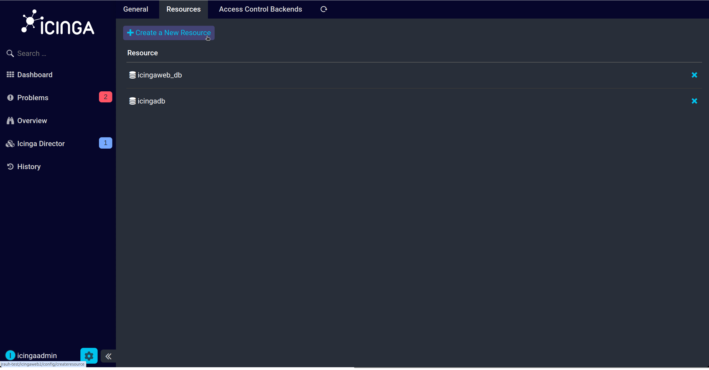
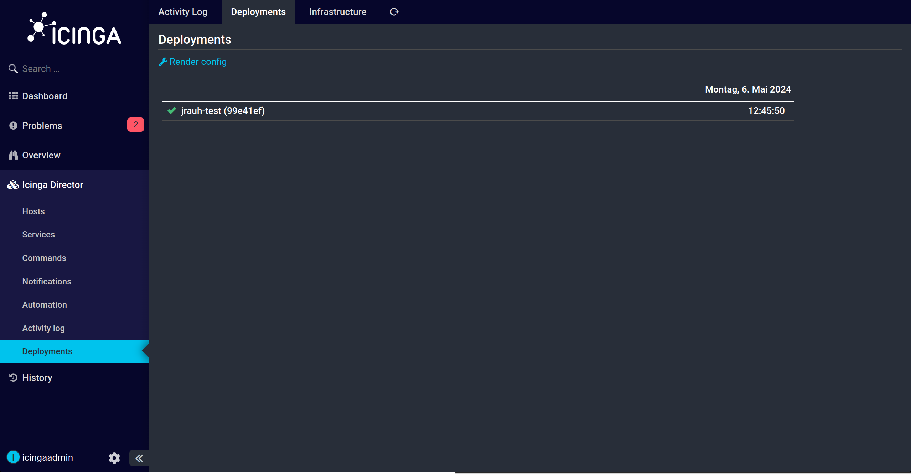
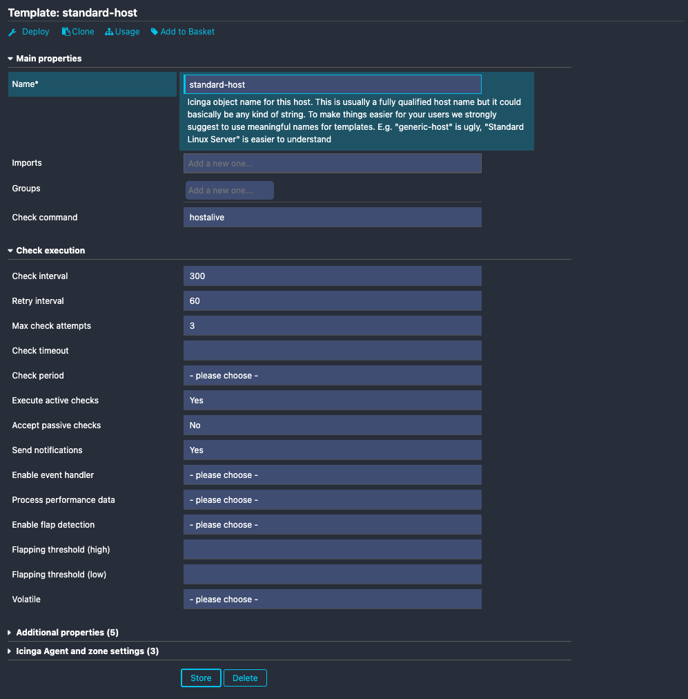

# Icinga Director Setup Walktrough

Icinga Director is a powerful module for Icinga Web that simplifies the configuration and management of your monitoring setup. It provides a user-friendly interface for defining hosts, services, and other monitoring objects, allowing you to automate and manage complex configurations with ease. Icinga Director integrates with various data sources, making it easier to keep your monitoring in sync with your infrastructure.

Log in to Icinga Web with an admin account and follow the steps below to do the initial Icinga Director setup.

## Configure Icinga Director

Create a new database resource for the Icinga Director database via `Configuration` > `Application` > `Resources`. The resource defines the connection details for the Director database you created before.

Fill the fields with the credentials of the director database user and continue. Make sure to set the Character Set to `utf8`.

Back in the Director menu, you will be asked to select a database resource. Pick the one you just created.

Next, the databse schema will be imported.

Icinga Director will ask for an Icinga 2 API user. This can either be the one which was auto-generated during the installation guide, or you can create a separate one. Fill the fields with the hostname of your master and the credentials of your API user.

The API user will be used by Icinga Director to validate and deploy new Icinga configuration items straight to Icinga 2.

Additionally, Icinga Director will import existing Check Command definitions. Those configuration items can later be used to simplify the usage of monitoring plugins.

Once the import has finished successfully, you will see the actual starting page of Icinga Director. You may notice that there are a couple of pending items in the Activity Log.

The Activity Log tracks each configuration change made to Icinga. It provides transparency, but also allows reviews before the changes are actually deployed. The pending changes you can see are the imported Check Command definitions.

Once you hit the "Deploy" button, the changes will be send to production. A green checkmark indicates a successfull deployment.

## Monitor your first Host
When installing Icinga 2 it comes with some default configuration which includes some basics to get started easier. This default configuration includes some basic templates and some standard checks, so your Icinga won't be completely empty after the first start. Icinga Director does not come with this default configuration. (Besides the command definitions you imported during the initial Director setup.)

This means that you have to do some preparation before you can add your first host with Icinga Director. There's not much work to do, though. Before adding your first host you need to create a host template.

The host template includes some basic parameters such as:

* **Check command**: Defines how to check the availability of a host. We use the `hostalive` check command which is the default for Icinga.
* **Check interval**: Defines the interval in which the check is executed
* **Retry interval**: Defines the interval in which to retry the check before marking it as a “hard state”
* **Execute active checks**: Actively execute the checks and don't wait for check results provided by third party tools or scripts
* **Accept passive checks**: Ignore check results provided by third party tools or scripts, only the checks executed directly by Icinga 2 are relevant
* **Send notifications**: Enable notifications for hosts using this template

Finally adding your first Host via Icinga Director is the easiest part, once all requirements are met and a template is available. There are some parameters that you have to fill in such as a host name, address and of course which host template to use.

Once the host template and host are created you are ready for your first deployment! You'll see the changes you made in the Activity Log. That's where you can track all changes made in detail. Not only those made by you, but also changes made by your team are visible here.

Hitting the “Deploy” button will send your changes to Icinga 2 and they will become available in the host overview. Icinga will start executing the checks in the defined interval and display the results in your web interface.

## Explore other Features of Icinga Director

Adding your first host is only the beginning. You can continue your journey of learning how to master Icinga Director through many different topics. For example, adding new service checks to your hosts is very similar to adding a host. Still, there are plenty of capabilities included in Icinga Director that are worth exploring. Here are some examples to continue reading:

* Learn more about the fundamentals of Icinga Director: [How your configuration gets rendered](https://icinga.com/docs/icinga-director/latest/doc/10-How-it-works/)
* Use Icinga's dynamic rule based configuration for service checks: [Working with Apply for rules – tcp ports example](https://icinga.com/docs/icinga-director/latest/doc/15-Service-apply-for-example/)
* Use Icinga Director to manage and deploy Icinga Agents on your machines: [Working with Agents and Config Zones](https://icinga.com/docs/icinga-director/latest/doc/24-Working-with-agents/)
* Automate your process by importing data from third party databases: [Import and Synchronization](https://icinga.com/docs/icinga-director/latest/doc/70-Import-and-Sync/)